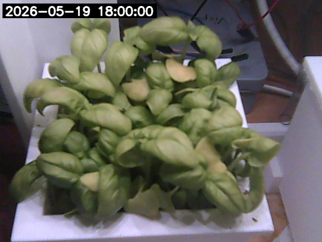

# demo2

asasdasdasd

## h2 cím

asdasdsad

### h3 cím

```py
x = 33

if (x > 30):
    print("x nagyobb mint 30")
elif (x == 30):
    print("x egyenlő 30-cal")
else:
    print("minden más: x nem nagyobb mint 30 és x nem egyenlő 30-cal")
```

##### Felsorolás

- a
- b
- c
- d
- e


1. a
2. b
3. c
4. d
5. e

> Ide jön az idézet
> 
> Második sora az idézetnek
> 
> Harmadik sora

